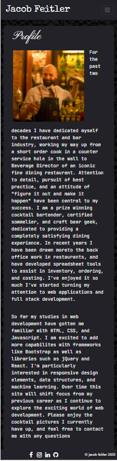
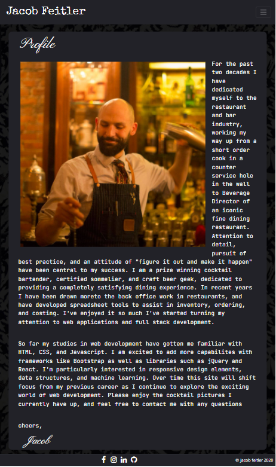
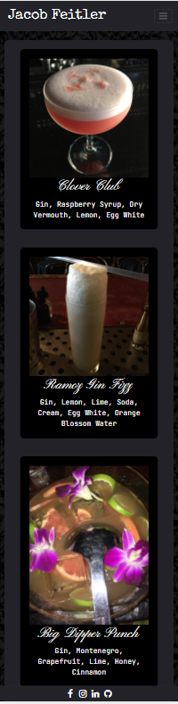
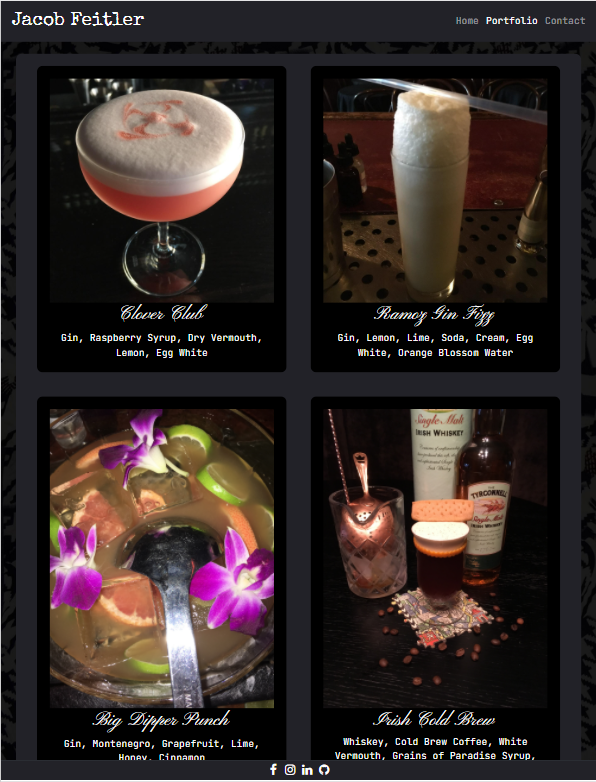
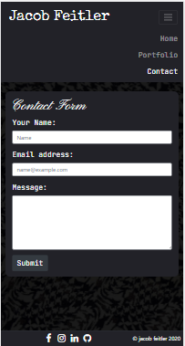
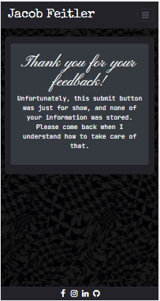
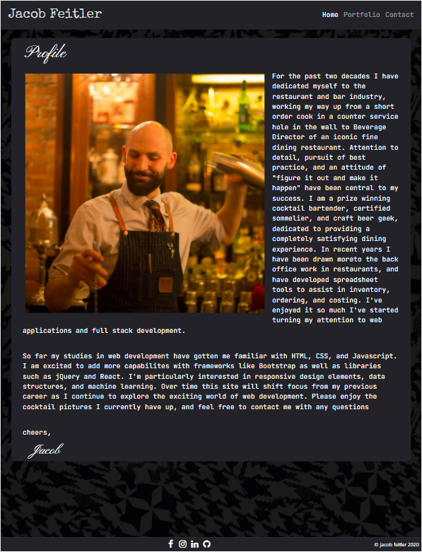

# My Profile Page

## About this page
This is my first profile page, using Bootstrap with minimal additional CSS for styling. I tried my best to keep a simple and clean design, taking advantage of the built in power of [Bootstrap](http://getbootstrap.com).

## Features

I had fun making a responsive design with a drop down navbar at smaller widths, adding a slight animation to the branding of my name, importing [Google Fonts](https://fonts.google.com/) as well as icons from [fontawesome](https://fontawesome.com/start).  

## Contents

* contact.html
* index.html
* portfolio.html
* submit.html
* (components)
    * (images)
        * apple-whiskey-sour.jpg
        * background-abstract-houndstooth.jpg
        * bartending.jpg
        * Big-Dipper.JPG
        * clover-club.jpg
        * Irish-Cold-Brew.JPG
        * Jolene.JPG
        * ramos-gin-fizz.jpg
        * Sonny&Esmerelda.JPG
        * (screenshots)
    *  (styles)
        * portfolio.css
        * styles.css

## Usage

Responsive design should be viewable on any platform.  Navbar dropdown is applied for screens 768 pixels and less.  Portfolio images move from 1 row to 2 at 

           

            

             

## Credits

Much of the work for this website was done referencing documentation on[Bootstrap](http://getbootstrap.com), [w3 Schools](http://w3schools.com), as well as [Codecademy](http://codecademy.com).  

## License

This website is licensed under the MIT license copywrite 2020